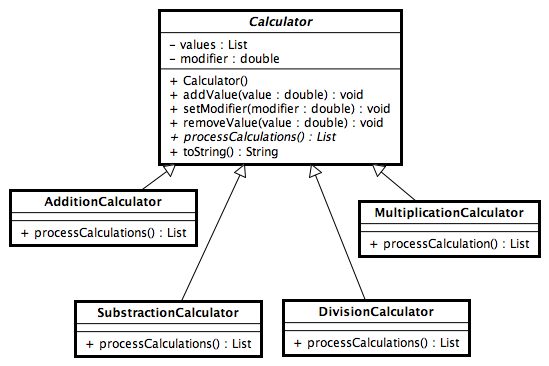

# "*Strategy - Calculator*" - Taskdescription

## Einführung
Ändere folgendes UML-Diagramm so um, dass es dem Strategy-Pattern enstspricht und implementiere dann dieses.

## Ziele
Verständnis des Strategy-Patterns und Umsetzung eines UML-Klassendiagrammes in einen funktionieren Code.

## Voraussetzungen
* Grundverständnis von Java
* Lesen und Umsetzen von UML Diagrammen
* Verwendung eines UML-Tools
* Automatisiertes Testen mittels Unit-Tests

## Detailierte Ausgabenbeschreibung
Die abstrakte Klasse Calculator hat die Aufgabe, Werte aus einer Liste mit einem modifier zu verändern und das Ergebnis als neue Liste zurück zu geben. Dazu dient die abstrakte Methode processCalculations, die in den konkreten Subklassen so überschrieben wurde, dass sie je nach Klasse die Werte aus der Liste mit dem modifier addiert, subtrahiert, multipliziert oder dividiert.

Es soll bei der Umsetzung das Strategy-Pattern zur Anwendung kommen. Dieses kann mit folgendem Klassendiagramm leicht erklärt werden:

## Bewertung
Gruppengrösse: 1 Person
### Grundanforderungen **überwiegend erfüllt**
- [x] Strategy-Interface für das Verhalten definieren
- [x] Methode ``List processCalculations()`` übernehmen
- [x] Calculator mit dem Verhalten "ausstatten"
### Grundanforderungen **zur Gänze erfüllt**
- [x] Verhaltensimplementierung in den konkreten Klassen (entsprechend den mathematischen Funktionen)
- [x] richtige Verwendung des Modifiers
- [ ] Implementierung von vier Testklassen

## Quellen
* [Strategy Pattern - Vince Huston](http://www.vincehuston.org/dp/strategy.html)
* [Strategy Pattern - Head First](https://www.oreilly.com/library/view/head-first-design/0596007124/ch01.html)
